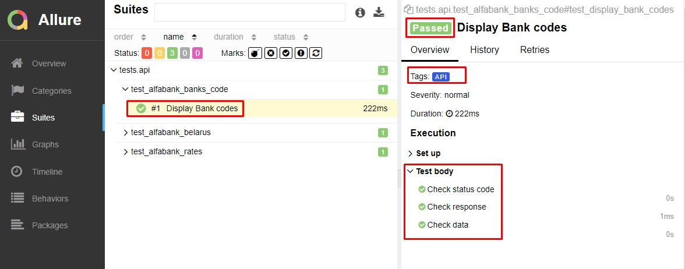

<p align="center">

</p>

## Демо-проект по автоматизации тестирования API: alfabank.by
:earth_americas: <a target="_blank" href="https://developerhub.alfabank.by/developerhub/site/pages/item-info.jag?name=partner.public&version=1.0.1&provider=admin&tab=doc">https://developerhub.alfabank.by</a>
<br>Исследуемый `api` взят из публичного источника. 
<br>Cервис позволяет получать:
- актуальные курсы валют Альфа-Банка 
- актуальные курсы валют Национального банка Республики Беларусь
- коды банков Республики Беларусь и Российской Федерации

## :four_leaf_clover: Languages and Tools:
<code></code>
<code></code>
<code></code>
<code></code>
<code></code>
<code></code>
<code></code>
<code></code>
<code></code>
<code></code>


## :watermelon: Реализованы следующие проверки*:
<p>*К тестам прилагается бонусный функционал:
* возможность запуска с любого компьютера без установки специального софта
* графический визуальный отчет

#### Для всех запросов проверяем, что:
<br>:white_check_mark: статус-код страницы 200
<br>:white_check_mark: тело api-запроса не пусто (!=0)
<br>:white_check_mark: schema (типы данных всех проверяемых значений) верные
  
#### Курсы валют банка:
<br>:white_check_mark: даты курса актуальна (всегда текущая)
<br>:white_check_mark: параметры запроса соответствуют ожидаемым значениям

<details>
    <summary><i>Details</i></summary>
	
При конвертация валюты Республики Беларусь:
```
['buyCode'] == 933
['buyIso'] == 'BYN'
['sellIso'] == 'EUR'
['name'] == 'евро'
```
При конвертации Российской валюты:
```
['buyCode'] == 643
['buyIso'] == 'RUB'
['sellIso'] == 'EUR'
['name'] == None
```
</details>

#### Курсы валют Национального банка Республики Беларусь
<br>:white_check_mark: даты курса актуальна (всегда текущая)
<br>:white_check_mark: параметры запроса соответствуют ожидаемым значениям

<details>
    <summary><i>Details</i></summary>

```	
['iso'] == "EUR"
['code'] == 978 
['name'] == "евро"
['iso'] == "USD"
['code'] == 840
['name'] == "доллар США"
```
</details>

#### Коды банков
<br>:white_check_mark: параметры запроса соответствуют ожидаемым значениям

<details>
    <summary><i>Details</i></summary>
	
```
['totalRowCount'] == 1
["bic"] == "ALFABY2X"
['name'] == "ЗАО 'АЛЬФА-БАНК', Г.МИНСК, РБ"
['address'] == прочерк
```
</details>

## :watermelon: Jenkins. Удаленный запуск тестов (онлайн) 
Не требует установки программ на компьютер пользователя! Работает "как есть" онлайн.

Способ 1. Быстрый вариант, только просмотр:
1. <i>Не зарегистрированным</i> пользователем перейти на страницу сборки проекта по ссылке: 
<a target="_blank" href="https://jenkins.autotests.cloud/job/C02_OlgaKos_python_alfabank_api_test/">Jenkins project</a>
2. Kликнуть на желтую иконку "Allure Report" и ознакомиться в графическим отчетом о результатах последнего запуска тестов. 
<a target="_blank" href="https://jenkins.autotests.cloud/job/C02_OlgaKos_python_alfabank_api_test/4/allure/#suites">Пример</a>
    
<p align="center">

</p>

Способ 2. Запустить тесты самостоятельно: 
1. <i>Зарегистрированным/Не зарегистрированным</i> пользователем перейти на страницу сборки проекта по ссылке: 
<a target="_blank" href="https://jenkins.autotests.cloud/job/C02_OlgaKos_python_alfabank_api_test/">Jenkins project</a>
4. Запустить выполнение тестов кнопкой "Собрать"
5. Дождаться окончания прогона (~2 минуты)
6. Кликнуть на желтую иконку "Allure Report" и получить свежий Allure Report. NB! срок хранения демо-сборки ограничен. Сборка может быть деактвирована ~через 8 недель.  
<p align="center">

</p>

###### Главный экран Allure отчета (Owerwiev)
<p align="center">

</p>

###### Страница с проведенными тестами (Suites)
<p align="center">

</p>

<details>
    <summary><i>Легенда</i></summary>

###### Главная страница Allure-отчета содержит следующие информационные блоки:
- `ALLURE REPORT` отображает: Дату и время прохождения теста. Общее количество пройденных кейсов. Диаграмму с указанием процента и количества успешных, упавших и сломавшихся в процессе выполнения тестов
- `TREND` - отображает тренд прохождения тестов от сборки к сборке
- `SUITES` - отображает распределение результатов тестов по тестовым наборам
- `ENVIRONMENT` - отображает тестовое окружение (стенд), на котором запускались тесты. <i>В данном демо-примере информация не задана.</i>
- `CATEGORIES` - отображает распределение неуспешно прошедших тестов по видам дефектов
- `FEATURES BY STORIES` - отображает распределение тестов по функционалу, который они проверяют
- `EXECUTORS` - отображает исполнителя текущей сборки (ссылка на сборку в Jenkins)

Бонус: команда получения Аллюр-отчета из терминала:
```
Шаблон:
(venv) D:\***\demo_alfabank_api2>allure\bin\allure.bat serve allure-results --clean-alluredir
Example:
(venv) D:\PythonParty\demo_alfabank_api2>allure\bin\allure.bat serve allure-results --clean-alluredir`
```

</details>

## :watermelon: Видео прохождения тестов
К каждому тесту (в отчете) прилагается автоматически сгенерированное видео. Пример:
<p align="center">
  
</p>

-------
2022-12-21